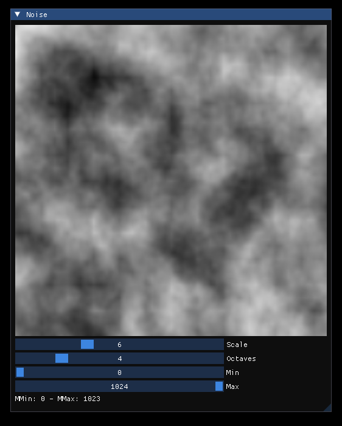
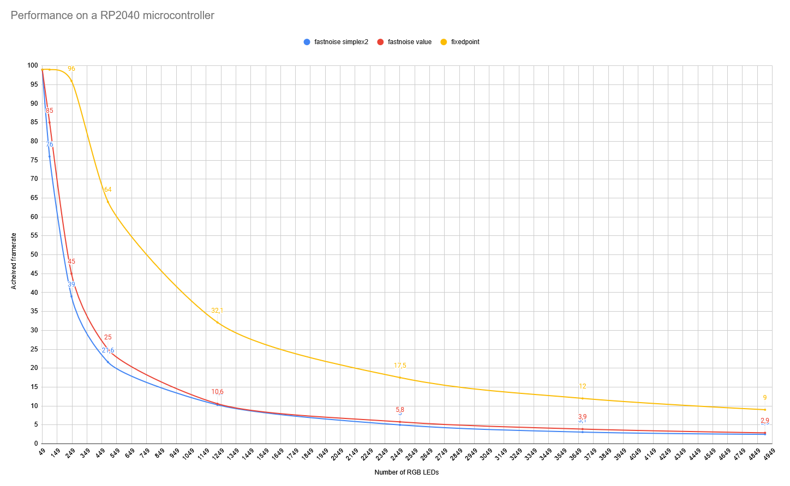

# Fixed Point 3D Noise

Basic 3D implementation of Perlin Noise for fixed point microcontrollers 



## Example

```c++
#include "FixedPoint3DNoise.hpp"

int main(int argc, char* argv[]) {
    // Init noise
    FixedPoint3DNoise noise;

    // Configure
    FixedPoint3DNoise::Params params = noise.getParams();
    params.scale = 4;
    params.octaves = 4;
    noise.setParams(params);
    
    // Compute a 255 cube of values [0 - 255]    
    for (int i=0; i < 255; i++) {
        for (int j=0; j < 255; j++) {
            for (int k=0; k < 255; k++) {
                int32_t value = noise.getValue(i, j, k);
                value = value * 255 / FixedPoint3DNoise::Scale;
            }
        }  
    }
}
```

## Performance on a Raspberry Pi Pico (RP2040)

The lib is able to achieve around 30 fps for 1000 RGB LEDs on one core

_todo: redo measurements with latest version of code_



## Resources

Inspired and borrowed from

- [FastNoiseLite](https://github.com/Auburn/FastNoiseLite)
- [Perlin Noise Youtube tutorial](https://www.youtube.com/watch?v=kCIaHqb60Cw)
- SDL3 + ImGui demo CMake from [CodotakuCMakeRepo](https://github.com/ilyas-taouaou/CodotakuCMakeRepo/blob/master/CMakeLists.txt)
